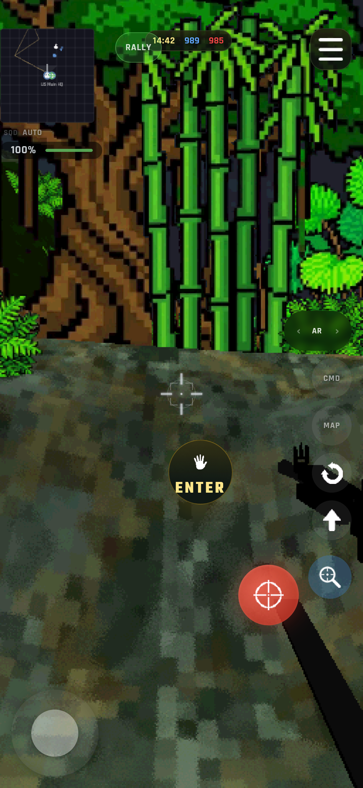

# Terror in the Jungle

A browser-based 3D first-person shooter set in the Vietnam War. Command squads, fly helicopters, and fight across procedural jungles and real-world terrain - all running at 60fps in your browser.

**[Play Now](https://terror-in-the-jungle.pages.dev)**

<p align="center">
  
</p>

## Features

- **5 game modes** from 20-player skirmishes to 3,000-agent battalion warfare on a 21km historical map
- **3 flyable helicopters** - UH-1 Huey, UH-1C Gunship, AH-1 Cobra with weapons, door gunners, and tactical insertion
- **3 flyable fixed-wing aircraft** - A-1 Skyraider, AC-47 Spooky, and F-4 Phantom with airfield spawns and per-aircraft flight tuning
- **7 weapon types** - M16A1, AK-47, Ithaca 37, M3 Grease Gun, M1911, M60 LMG, M79 grenade launcher
- **4 factions** - US Army, ARVN, NVA, Viet Cong with faction-specific loadouts
- **Real terrain** - A Shau Valley built from USGS DEM elevation data
- **Procedural worlds** - noise-driven terrain with biome-aware vegetation, firebases, and airfields
- **AI combat** - 8-state FSM with squad tactics, suppression, flanking, and cover search
- **Mobile + desktop** - touch controls with virtual joystick, or keyboard and mouse

## Game Modes

| Mode | Scale | Duration | Description |
|------|------:|--------:|-------------|
| Zone Control | 20 | 3 min | Capture and hold strategic zones. Control the majority to drain enemy tickets. |
| Team Deathmatch | 30 | 5 min | First team to the kill target wins. Pure tactical combat. |
| Open Frontier | 120 | 15 min | Large-scale warfare with helicopters, airfields, and armored staging areas. |
| A Shau Valley | 3,000 | 60 min | Historical campaign on real DEM terrain with a war simulator and strategic AI. |
| AI Sandbox | configurable | 60 min | Automated AI combat for testing and observation. |

## Quick Start

```bash
npm install
npm run doctor     # Verify Node, dependencies, and Playwright browser setup
npm run dev        # Development server
npm run validate:fast
npm run build      # Production build
npm run validate   # Lint + tests + build + smoke test
npx tsx scripts/fixed-wing-runtime-probe.ts --port 4173
```

Requires Node 22 (pinned in `.nvmrc`) and a browser with WebGL2.

## Tech Stack

[Three.js](https://threejs.org/) 0.184 | TypeScript 6.0 | Vite 8 | Vitest 4 | Playwright 1.58 | [Recast Navigation](https://github.com/isaac-mason/recast-navigation-js) (WASM navmesh)

44 game systems, 75 GLB models, 38 pixel-art UI icons, CDLOD terrain with real-time LOD.

Deployed on [Cloudflare Pages](https://terror-in-the-jungle.pages.dev), CI-gated (lint + test + build + smoke).

## Documentation

| Doc | Purpose |
|-----|---------|
| [Architecture](docs/ARCHITECTURE.md) | System overview, tick graph, coupling heatmap, key patterns |
| [Roadmap](docs/ROADMAP.md) | Vision, phase plan, resolved decisions |
| [Performance](docs/PERFORMANCE.md) | Profiling commands, scenarios, bottleneck status |
| [Development](docs/DEVELOPMENT.md) | Testing, CI, deployment, pre-push checklist |
| [Backlog](docs/BACKLOG.md) | Open work, known bugs, architecture debt |
| [Asset Manifest](docs/ASSET_MANIFEST.md) | 75 GLBs, integration status, art direction |

## Contributing

```bash
npm run validate:fast
npm run validate   # Must pass before PR
```

See [docs/DEVELOPMENT.md](docs/DEVELOPMENT.md) for the full testing and deployment guide.

## License

MIT - see [LICENSE](LICENSE).
